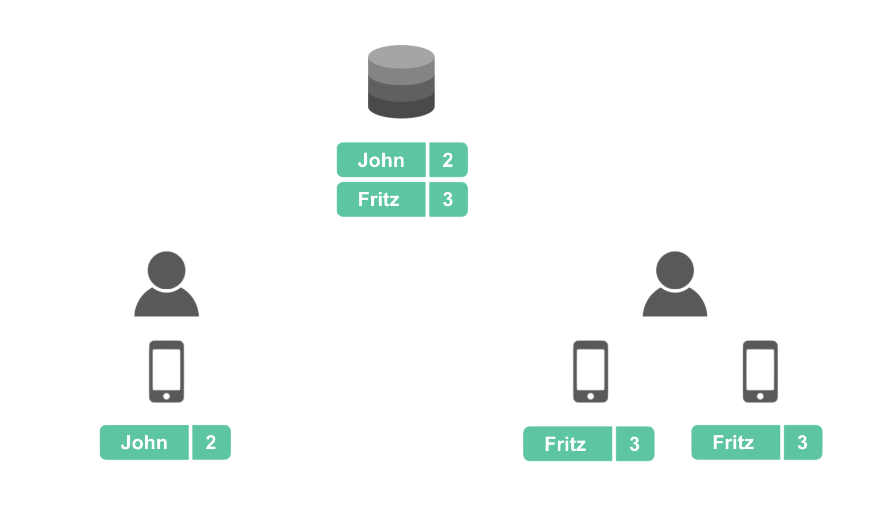

<h1 align="center">OctoDB Documentation</h1>

Why?
----

For those who prefer to use a relational database on their apps and want to merge and synchronize the rows from the users into a single db on the backend, making it possible and easy to run SQL queries on the merged rows.

Also for those who want to distribute data to users (or send commands to machines) by simply adding a row on a table.

All in a simple way, without needing to learn data replication.

What It Is
----------

A modification of the SQLite library to allow replication of schema and synchronization of rows

SQLite is used both on the secondary nodes (devices) as in the primary nodes (backend)

It can handle millions of devices connected simultaneously

How It Works
------------

The databases from the users/machines are always connected to the primary nodes (if the device is online)

The administrator (anyone with access to the primary nodes) can create tables and indexes on a primary node (backend) and the schema will be replicated to the other primary nodes and to all the secondary nodes (users/machines)

When users or machines create rows on the local instance of a table, the rows are replicated to the backend and merged on a single table

### The `row_owner` column

To enable row replication on a table we use a special column with the name `row_owner`. This column holds information about the row ownership. We can add this column when the table is created or later

Here is an example of creating a table with the row_owner column:

    CREATE TABLE contacts (id INTEGER PRIMARY KEY, name, email, row_owner)

And here is an example of adding the row_owner column to an existing table:

    ALTER TABLE contacts ADD COLUMN row_owner

When the column is added to an already populated table, all the rows remain local

### Row Types

There are 3 types of rows that can be on these tables:

* User rows
* Global rows
* Local rows

#### User rows

The *user rows* are created by the user/machine locally and then are synchronized to the same table on the backend and to other devices of the same user/machine. These rows are owned by the user/machine and identified by the `user_id` on the `row_owner` column.

#### Global rows

The *global rows* are created at the primary nodes and then are replicated to all the nodes (users/machines). These rows are owned by the administrators and identified by a `*` on the `row_owner` column.

#### Local rows

The *local rows* can be created at any node. They are not replicated, they are present only at the local device. These rows are identified by a `NULL` on the `row_owner` column.

#### Mixing all

It is possible to have different types of rows on the same table

 Row Type   | row_owner
----------- | ----------
 User row   | {user_id}
 Public row | *
 Local row  | NULL

When the application executes an `UPDATE` or `DELETE` SQL command on the user's device the command will only affect the rows from that user (user rows and local rows).

## Inserting Rows

Here are some examples according to the row type

### User row

Do not specify the `row_owner` on the list of columns:

    INSERT INTO contacts (name,email) VALUES ('John','john@email.com')

Or use the `this_user()` function as the value:

    INSERT INTO contacts (name,email,row_owner) VALUES ('John','john@email.com',this_user())

### Public row

Insert a `*` on the `row_owner` column. This is only possible on primary nodes:

    INSERT INTO contacts (name,email,row_owner) VALUES ('John','john@email.com','*')

### Local row

Insert a `NULL` on the `row_owner` column:

    INSERT INTO contacts (name,email,row_owner) VALUES ('John','john@email.com',NULL)

### Sending Rows to Specific Users / Machines

The primary nodes (backend) can insert rows that are replicated only to specific users

This is done by informing the user id on the `row_owner` column when inserting the row:

    INSERT INTO queue (command,row_owner) VALUES ('do something',123)

This can be used to send messages to specific users or machines. If the device is off-line it
will retrieve the content on the next time it becomes on-line

The user becomes the owner of the row, so it can update or delete it

## Updating the value of the `row_owner` column

It is not possible to transfer the ownership of a row to another user

But we can increase the visibility of a row (change the row type)

These are the allowed modifications:

* From local row (only on this device) to a user row (shared between the devices from the same user and shared with the primary nodes)

      UPDATE table SET row_owner = this_node() WHERE ...

* Rows from the administrator can become public rows

      UPDATE table SET row_owner = '*' WHERE ...

## Rename or Remove the `row_owner` column

These operations are not allowed. You must drop the table and recreate it.

    CREATE TABLE new_table AS SELECT ... FROM old_table
    DROP TABLE old_table

Notice that the new table without the `row_owner` column can only contain local rows. These rows are NOT replicated to other devices.

## Tables without the `row_owner` column

There is no replication or synchronization of rows on these tables, they can only contain local rows.

## Private tables

> Under testing - not yet available!

The "private tables" are replicated only at the primary nodes. They are useful when you do not want the secondary nodes to have even the table structure.

Example use: to store information about each user or machine or device, like login. Or to store any other information that are for internal use.

To create a private table use the `private_` prefix on the table name:

    CREATE TABLE private_users (user_id INTEGER PRIMARY KEY, name, email, row_owner)

The same rules apply for replication of rows: we need to add a `row_owner` column if we want to replicate rows between the primary nodes, and we need to set the value accordingly for user rows and local rows.

## Sync Users Devices

When a user adds a new device, the shareable content is replicated to the new device

The user can now make changes on any device and the content is synchronized on the other

## Conflicts

Conflicts on insertions are avoided by using a special numbering on the row ids

Each device has a unique "node id". When inserting rows to a "rowid table" the row id will be composed of the node id + a sequential number

For this reason we must use an `INTEGER PRIMARY KEY` field when creating a table that will contain replicated rows

Example:

    CREATE TABLE contacts (id INTEGER PRIMARY KEY, name, email, row_owner)

And avoid text and multi-column primary keys and `WITHOUT ROWID` tables

If you need to use these kind of primary keys you can still avoid conflicts on insertions by either using a unique prefix for each device or using a random prefix

    CREATE TABLE node_settings (node INTEGER, name TEXT, value TEXT, row_owner, PRIMARY KEY(node,name)) WITHOUT ROWID

If no precaution is used regarding primary keys then OctoDB will accept the first insertion that arrives on the primary nodes and the subsequent ones with the same primary key will be rejected as a contraint violation (duplicated primary key). Notice that the entire transaction comming from the secondary node will be rejected in this case.

Conflicts on `UPDATE` commands: the last command to arrive on the primary nodes will overwrite the content from previous modifications

Conflicts on `DELETE` commands: the first command to arrive on the primary nodes will delete the row(s) and the subsequent ones will fail silently

Conflicts that trigger contraint violations, like `CREATE TABLE` with the same name, work in "native" way: the first command succeeds and the conflicting ones fail

> Important!
> 
> When a command is rejected on the primary nodes the whole transaction is rolled back! Have this in mind when creating transactions on your apps

Limitations
-----------

Permanent:

- A single connection to each db file
- Up to 2^31 (2,147,483,647) total nodes (between primary and secondary), each node can have up to 2^32 (4,294,967,296) rows on EACH table  *(please contact if you have different requirements)*

On the current version, to be improved:

- Only simple `UPDATE` commands, without `FROM`/`JOIN` and `LIMIT` clauses, and without agregation on the `WHERE` clause
- Only simple `DELETE` commands, without `LIMIT` clause
- Nearly 1000 writes per second overall (no limit on reads)

Security
--------

[User and Node Authorization](auth.md)

[Encryption](encryption.md)

Installation
------------

[Download](http://octodb.io/en/download.html) binaries (free version)

[Compile](compile.md) from source

How To Use It
-------------

Here are the steps for an application:

1. Open the db using a URI
2. Wait until the database is ready for access
3. Use the database

Important Notes:

- Your application needs to use the OctoDB library instead of the system's SQLite library. Check details for each programming language
- Do not ship a db file with the app! The database will be downloaded from the primary nodes on the first connection
- Create tables with integer primary keys. If text is required, use a unique prefix for each device or create a multi-column primary key with the prefix column as the first one
- Open a single connection to each db file

Examples
--------

* [Python](examples/python.md)
* [Node.js](examples/nodejs.md)
* [Java](examples/java.md)
* [.NET](examples/dotnet.md)
* [Go](examples/go.md)
* [Swift](examples/swift.md)
* [Ruby](examples/ruby.md)
* [C](examples/c.md)
* [C++](examples/cpp.md)
* [C++/Qt](examples/qt.md)

Mobile

* [Android Native](examples/android-native.md) (Java)
* [iOS Native](examples/ios-native.md) (Swift)
* [Xamarin](examples/xamarin.md)

Support
-------

[OctoDB Forum](http://octodb.io/forum/)

E-mail: contact **AT** octodb **DOT** io
