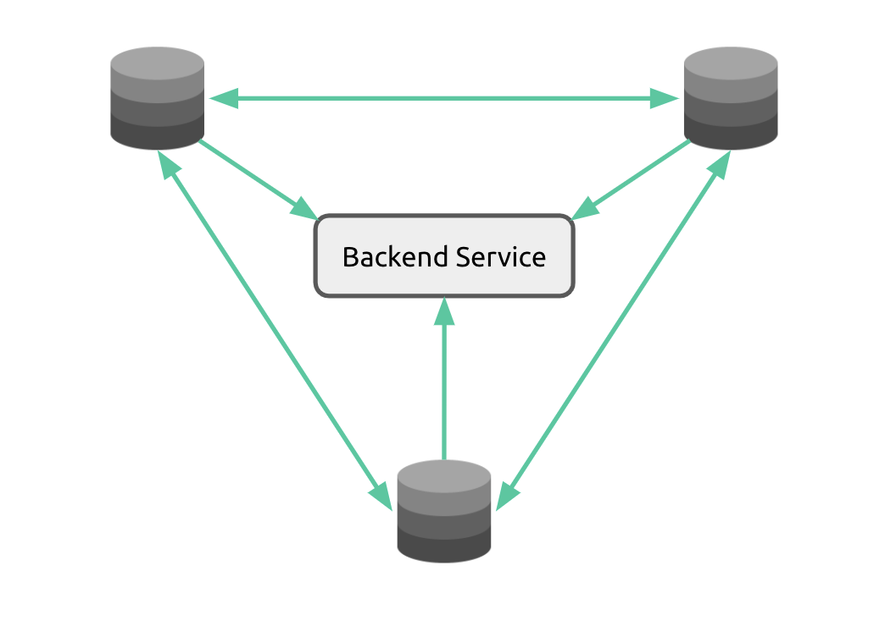

Authorization Service
=====================

In this case you need to deploy a service that binds to a TCP port in which all the primary nodes will connect to.

<p align="center"></p>

Your backend application running on all the primary nodes must register the service by executing this command:

```
PRAGMA authorizer_service="tcp://ip.address:port"
```

The authorization requests received on the primary nodes are redirected to the authorization service


Implementing the service
------------------------

It is easier to implement the backend service in Node.js, by using the `@octodb/backend-service` package:

```
# using Yarn
yarn add @octodb/backend-service

# using npm
npm install @octodb/backend-service
```

Here is the skeleton of a backend service:

```js
const app = require('@octodb/backend-service');
const port = 12345

app.on('user_signup', (node, data) => {
  return 0  // assign a new user id
})

app.on('user_login', (node, data) => {
  return -1  // unauthorized - requires further logic to identify the user
})

app.on('new_node', (node) => {
  return node.type
})

app.run(port, function() {
  console.log('auth service ready!')
})
```

### External Database

Here is an example service that stores the user credentials (e-mail and hashed password) on an SQLite database:

> This example can be used with the free version

```js
const app = require('@octodb/backend-service');
const db = require('better-sqlite3-octodb')('users.db', {});
const port = 12345

db.exec("CREATE TABLE IF NOT EXISTS users (id INTEGER PRIMARY KEY, email, password)");
db.exec("INSERT OR IGNORE INTO users VALUES (1,'reserved',null)");

function find_user(email) {
  return db.prepare('SELECT * FROM users WHERE email = ?').get(email);
}

app.on('user_signup', (node, data) => {
  console.log('user_signup', node, data)
  var user = find_user(data.email);
  if (user && user.id > 0) return -1;  // unauthorized - user already signed up
  var res = db.prepare("INSERT INTO users (email,password) VALUES (?,?)").run(data.email, data.passwd)
  return res.lastInsertRowid
})

app.on('user_login', (node, data) => {
  console.log('user_login', node, data)
  var user = find_user(data.email);
  if (user && user.password == data.passwd) return user.id;
  console.log('user not found')
  return null;
})

app.on('new_node', (node) => {
  console.log('new_node', node)
  return node.type
})

app.run(port, function() {
  console.log('auth service ready!')
})
```

### Internal Database

Here is an example service that stores the user credentials (e-mail and hashed password) on the OctoDB database itself:

> This example can only be used with the full version, because it uses one table

```js
const app = require('@octodb/backend-service');
const port = 12345

app.on('user_signup', (node, data) => {
  console.log('user_signup', node, data)
  var sql = `INSERT INTO users (email,password) VALUES ('${data.email}','${data.password}')`
  return { pubkey: node.public_key, execute: [sql] }
})

app.on('user_login', (node, data) => {
  console.log('user_login', node, data)
  var sql = `SELECT id AS user_id FROM users WHERE email = '${data.email}' and password = '${data.password}'`
  return { pubkey: node.public_key, find: sql }
})

app.on('new_node', (node) => {
  console.log('new_node', node)
  return node.type
})

app.run(port, function() {
  console.log('auth service ready!')
})
```


Other programming languages
---------------------------

You can implement the backend service in other programming languages

The supported network protocol is TCP with length-prefix framing

All the primary nodes will connect to and send requests to the service, but the service MUST send the
responses to a single node, called the leader node

The leader node informs the service that it is the leader with a message exactly as this:

    {"leader":true}


The service will receive requests in this format:

    {action:"user_signup",data:"...",pubkey:"..."}

If the data sent by the secondary node is in JSON format, then the data is embedded in the parent JSON object, like this:

    {action:"user_signup",data:{your_json:"object"},pubkey:"..."}

The `action` can be:

* user_signup
* user_login
* new_node


Storing user data
-----------------

As the service runs separated from the primary nodes it has 3 options for storing user authorization.
You can check the instructions according to the storage type:

* [OctoDB](auth-service-octodb.md)
* [External database](auth-service-external-db.md)
* [Both external database and OctoDB](auth-service-external-octodb.md)
